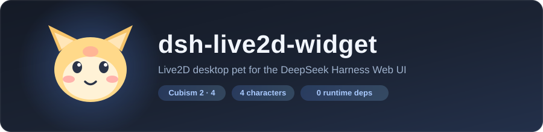
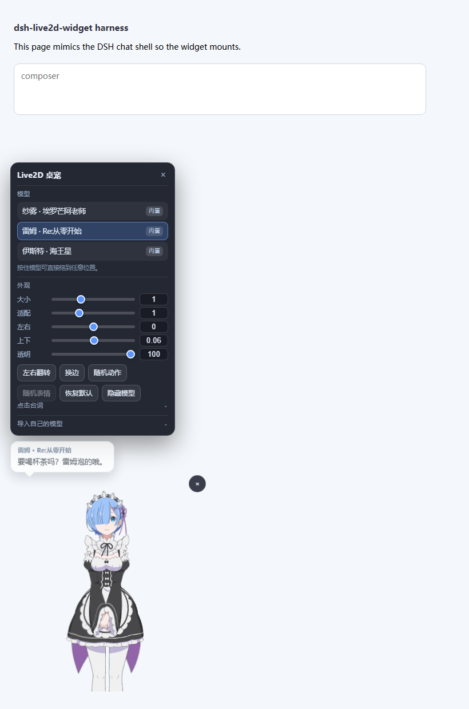
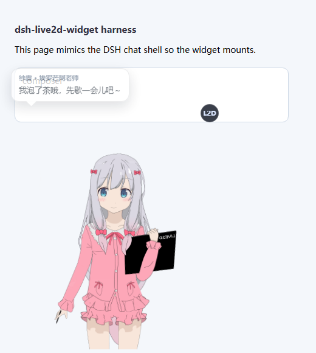
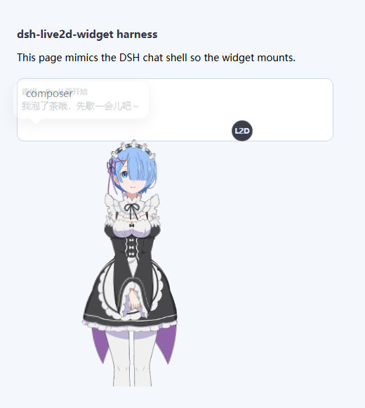
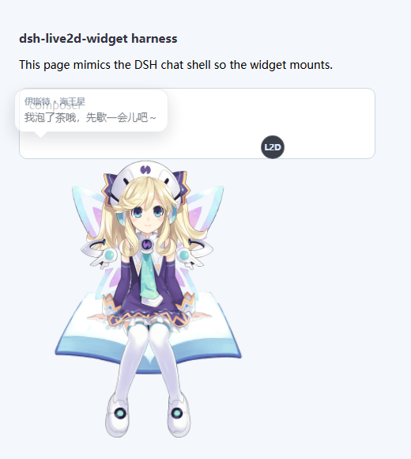
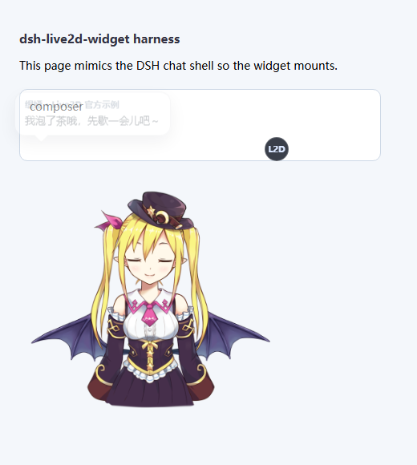

<p align="center">
  
</p>

<p align="center">
  <a href="README_ZH.md">简体中文</a> | <strong>English</strong>
</p>

<p align="center">
  <a href="LICENSE"></a>
  
  
  
  
  
  
</p>

# dsh-live2d-widget

> A Live2D desktop pet for the DeepSeek Harness Web UI: open DSH and a cute anime character is
> already standing in the corner of the chat view. Four characters ship in the box and switch with
> one click; click the model and she says something in character from a speech bubble (and you can
> rewrite every line); import your own models any time. Zero runtime dependencies, pure plugin
> mount — installing enables it, uninstalling leaves nothing behind.

## Highlights

- **Cute characters included** — Sagiri, Rem, Histoire and Tia, spanning the Cubism 2 and Cubism 4 runtimes.
- **Click to talk** — clicking the model pops a line written for that character, with her name on the bubble. **Every character's lines are editable** (one per line, stored locally).
- **Drag to place** — hold the model and drag it anywhere on screen; it is remembered across restarts.
- **Free switching** — one click in the panel; each model keeps its own fit, position and lines.
- **Import your own models** — a `.zip`, a model folder, or a path on this machine. Entry files are found **by content**, so `model.json`, `rem.json` and arbitrary names all work.
- **Sane sizing** — "大小" resizes the *canvas*, so the character grows proportionally and is **never cropped**; "适配" separately tunes how much of the canvas the model fills.
- **Precise input** — every value has both a slider and a field: drag it, type an exact number, or press and drag sideways on the number to scrub.
- **Out of the way** — sits in one corner by default, hides with `Ctrl+Shift+L`, and lets clicks through to the chat UI.
- **Zero runtime dependencies** — the Live2D runtime ships in the package as a single JS file (no CDN, no network), and unzipping is a dependency-free implementation too.
- **Does not pollute DSH** — the whole widget lives in a Shadow DOM, so neither DSH's stylesheet nor other plugins can touch it, and vice versa.

## Preview

<p align="center">
  
</p>

## Quick start

Requires [DeepSeek Harness](https://github.com/deepseek-ai/deepseek-harness) (the `dsh` command) and
**Node.js `^22.19 || >=24`** (the same range DSH itself requires).

Pick any one of three install paths:

```powershell
# 1) From GitHub (recommended: all 4 bundled characters come with it)
dsh plugin --profile web add github:xieluyang912/dsh-live2d-widget

# 3) From a local directory (development: pnpm makes a junction, so edits apply immediately)
dsh plugin --profile web add link:D:/Plugins/dsh-live2d-widget

# Uninstall
dsh plugin --profile web remove dsh-live2d-widget
```

`dsh plugin` proxies straight to pnpm (everything after `--profile web` is passed through), so any
specifier pnpm accepts works: `github:`, `git+https:`, a plain npm name, `link:`, a tarball.

The command writes the plugin into `dsh.profile.bundles` in
`%USERPROFILE%\.dsh\profiles\web\package.json` — **no hand-editing of the profile patch required**.

> **Nothing is built when installing from git or npm.** The plugin is plain JavaScript with no build
> step and no `install` / `prepare` lifecycle script, so pnpm's `ERR_PNPM_IGNORED_BUILDS` never
> applies and it works the moment it lands.

> **Changes need a reload, and the two halves reload differently.**
>
> - **The browser half** (`assets/live2d-widget.js`, `assets/vendor`) is **re-read from disk on every
>   request** — refresh the page.
> - **The host half** (`lib/index.js`, the bundled model list and model files) is **read into process
>   memory at startup**, so it needs a `dsh web` restart. DSH refuses to reload plugins while an agent
>   is running (its plugin-market log says `refused while agents are running`), so either finish the
>   current session or restart manually.
>
> To tell which half you are looking at: if the panel has "大小 / 适配 / 点击台词" but the model list is
> still the old one, the **browser half is updated and the host half is stale** — restart and it matches.

## Usage

After opening DSH a character appears in the bottom-left corner. The round **L2D** button at her
top-right opens the control panel.

| Section | What it does |
| --- | --- |
| **Model** | Click any entry to switch instantly. Entries marked 导入 are yours; `×` deletes them. |
| **大小** | Overall size (0.4× – 2.2×). This resizes the canvas, so the character grows with it and is **never cropped**. |
| **适配** | How much of the canvas the model fills (0.1 – 3.0). Mainly for imported models; the bundled ones are pre-calibrated, so 1 is right. |
| **左右 / 上下** | Fine position inside the canvas (−2 – 2). |
| **透明** | Overall opacity (15 – 100). |
| **左右翻转 / 换边** | Mirror, and swap between the bottom-left and bottom-right corners. |
| **随机动作 / 随机表情** | Poke the model on demand (greyed out when it has no motions or expressions). |
| **恢复默认** | Reset the current model's size, fit, position and appearance to the built-in defaults. |
| **隐藏模型** | Tuck it away; `Ctrl+Shift+L` brings it back. |
| **点击台词** | Collapsible: bubble toggle, dwell time, line editor. |
| **导入自己的模型** | Collapsible: the three import paths. |

### Three ways to set a value

Every number can be set three ways, and all three stay in sync:

1. **Drag the slider** — the obvious one.
2. **Type a number** — into the field on the right; commit with Enter or by clicking away.
   Out-of-range values clamp to the limit, and unparsable text reverts to the value still in effect.
3. **Press and drag the number sideways** — scrubbing (about 320px sweeps the whole range). If you
   press and release without moving, the field focuses so you can type instead.

### Speech bubble

- Expand **点击台词** and tick **点击模型时说话**; clicking the model then pops a random line.
- In the text box, **one line per message**. "保存台词" commits, "恢复默认台词" restores the character's
  built-in persona, "试说一句" previews immediately.
- **停留** controls how long the bubble stays up (2 – 20s).
- Lines are **stored per model**, so each character can have its own voice.
- Switching models also greets you with a line.

The shipped lines are written in character — Rem says 「雷姆，会一直相信你的。」, Sagiri says
「哥哥，你回来啦……」, Histoire says 「知识，就是力量哦。」.

### Dragging and shortcuts

**Hold the model and drag** it wherever you like; it is remembered. A drag never also fires a line.
Placing it near the top of the screen is fine — the panel shrinks itself so it stays on screen.

| Action | Effect |
| --- | --- |
| Drag the model | Move it (remembered) |
| Single click the model | Say a line |
| `Ctrl+Shift+L` | Show / hide the model |
| Click the **L2D** button | Open / close the control panel |

## Importing your own models

The import section offers three paths; all of them strip the archive's or folder's single top-level
directory automatically.

| Path | Best for |
| --- | --- |
| **Choose a zip archive** | The common case — model packs usually ship as zip |
| **Choose a model folder** | A model already unpacked on disk |
| **Type a local directory** | Large models: the plugin reads straight from disk instead of uploading through the browser |

The entry file is found **by content**: Cubism 3/4/5 is recognised by `FileReferences.Moc`, Cubism 2 by
a top-level `model` plus `textures`. So it can be called `model.json`, `rem.json`, `chara-def.json` or
anything else — no naming convention required. When a directory holds several valid entries (the same
character in several outfits, say), the bundled models name theirs explicitly, and an imported pack can
simply contain only the outfit you want.

> Model assets belong to their original rights holders. Make sure you have the right to use whatever
> you import — many models forbid commercial use or redistribution. This plugin only provides the
> loading capability and ships none of your imported models.

## Bundled characters

| Character | From | Cubism |
| --- | --- | --- |
| Sagiri · Eromanga Sensei | Eromanga Sensei | 2 |
| Rem · Re:Zero | Re:ZERO -Starting Life in Another World- | 2 |
| Histoire · Neptunia | Hyperdimension Neptunia | 2 |
| Tia · Live2D official sample | Live2D official sample model | 2 |

<p align="center">
  
  
  
  
</p>

Model assets come from the public collection
[Eikanya/Live2d-model](https://github.com/Eikanya/Live2d-model) and **remain the property of their
respective rights holders**; they are not covered by this plugin's MIT license (see [LICENSE](LICENSE)).

## How it works

The plugin has a host half and a browser half:

```text
DSH web app
  │  tapIndex injects <script defer src="/dsh-live2d/widget.js">
  ▼
browser half (Shadow DOM: canvas + speech bubble + control panel)
  ├─ GET  /dsh-live2d/runtime.js        Live2D runtime (vendored, self-contained)
  ├─ GET  /dsh-live2d/api/state         model list + settings + skipped models
  ├─ POST /dsh-live2d/api/settings      persist preferences
  ├─ POST /dsh-live2d/api/import-zip    raw zip upload
  ├─ POST /dsh-live2d/api/import-files  folder upload (base64)
  ├─ POST /dsh-live2d/api/import-path   read a local directory directly
  ├─ POST /dsh-live2d/api/delete        delete an imported model
  └─ GET  /dsh-live2d/model/<id>/<rel>  model files (prefix route + ETag)
  ▲
  │  every route first passes ctx.connection.requestRejection()
host half (lib/index.js, inside the DSH process)
```

- **Host half** registers routes with `ctx.webServer.register` and injects the script with
  `ctx.webServer.tapIndex`. Model files are served by one `prefix` route whose paths go through `..`
  filtering plus a `realpath` check, so a symlink cannot escape the model directory either.
  Large textures use ETag + `Cache-Control: immutable`, so the browser fetches them once.
  A model whose entry file is 0 bytes (a truncated copy) is skipped explicitly and reported in
  `/api/state`'s `skipped`, rather than letting the runtime fail with an opaque
  `Unexpected end of JSON input`.
- **Browser half** lives entirely in a Shadow DOM, initialises only on the main chat view (below), and
  uses `z-index: 90` — above the chat content, below DSH's own popovers and dialogs.

### Four traps worth knowing (all documented in the code)

1. **Initialise the runtime once; switch models with repeated `load()`.** `l2d`'s `destroy()` does
   **not** release the WebGL context, so calling `init()` per switch leaks a context each time until
   the browser drops the oldest one and the model goes blank.
2. **The widget must own the canvas's CSS size.** The runtime's bootstrap helper **freezes**
   `style.width/height` onto the canvas the first time its computed size equals its attribute size;
   once frozen, the canvas stops following its container — which looks like "the size slider does
   nothing / the model is cropped". So `applyStyles()` writes `canvas.style.width/height` every time.
3. **Size cannot come from scaling the model.** The runtime first **fits** the model to the canvas and
   `scale` multiplies that fit, so any `scale` past the calibrated value only crops the character.
   Hence "大小" changes the **canvas** and "适配" changes the fill ratio.
4. **Mount readiness must be observed, never assumed.** DSH paints a "Loading plugins…" overlay into
   `#root` first, and the composer only appears once every plugin has loaded. So the widget watches
   with a **MutationObserver** (up to 5 minutes) instead of giving up after a few seconds — otherwise
   a slow cold start silently leaves you with no model.

### Where the defaults come from

Live2D models have no canonical size: each author draws the character at an arbitrary scale inside its
own canvas, so one global default cannot make them all look right. `tools/calibrate.html` loads each
model in turn, reads the drawn pixels back, and iterates `scale`/`position` until the silhouette is
centred and fills the canvas height. The bundled defaults were measured that way (targeting 88% of the
height, leaving 12% of margin to absorb the silhouette wobble of the idle animation).

## Files and settings

Everything lives under `%USERPROFILE%\.dsh`, so reinstalling the plugin keeps it:

| Path | Contents |
| --- | --- |
| `.dsh-live2d.json` | Active model, size, appearance, per-model fit and position, per-model custom lines, imported-model registry |
| `live2d-models/<id>/` | The model files you imported |

## Security boundary

- Every custom route first calls `ctx.connection.requestRejection()`: forged Host/Origin
  (DNS-rebinding) and **unauthenticated** requests are refused, the same trust fence the official
  plugins use.
- Model-file routes apply `..` filtering plus a `realpath` check, so symlinks cannot escape either.
- Import bounds file count, per-file size and total uncompressed size, to resist zip bombs.
- The plugin ships no sandbox: file, shell, sandbox and approval policy come entirely from the current
  DSH profile.
- The plugin makes no network calls: the runtime is vendored and models are read from local disk.

## Known limitations

- All four bundled characters are **Cubism 2**; Cubism 3/4/5 (`*.model3.json`) is supported by the
  runtime and reachable by importing.
- Setting **适配** above 1 makes the model overflow the canvas, which crops it — that is what the
  control is for (enlarging a model that was authored tiny). Use **大小** to make everything bigger.
- The panel has to fit in the space above the model; when there is not enough (a large model or a short
  window) it automatically switches to **overlaying the model** instead.
- Hiding the model is visual only — the render loop keeps running. Hide it *and* close the page to stop it.
- Audio is muted: if an idle motion carries a sound effect, it plays at volume 0.

## FAQ

**The model vanished / I want it back** — press `Ctrl+Shift+L`, or delete `.dsh-live2d.json` to return
to defaults.

**Clicking the model says nothing** — check the toggle in 点击台词. With an empty line box you get the
placeholder line 「……」.

**Import fails with "no Live2D model file found"** — the archive has neither `*.model3.json` /
`*.model.json` nor any JSON containing `model` + `textures` (or `FileReferences.Moc`). Some packs ship
only textures and a `.moc3` with no model description; such a pack is incomplete and no loader can use it.

**Import fails with "unsupported compression" / "this zip is encrypted"** — use an unencrypted plain
zip. The bundled reader supports store and deflate; not encryption or multi-volume archives.

**The model renders blank / it reports an empty entry file** — the file was truncated to 0 bytes during
a copy. Copy the model again; the plugin lists such models under `skipped` with the reason.

**Some panel sections are missing** — 点击台词 and 导入自己的模型 start collapsed; click their headers.

## Development

```powershell
# Standalone dev server: mounts the plugin on a stub ctx and serves it over plain HTTP
# (no DSH auth, which makes debugging easy)
node tools/harness.mjs 8899
```

The harness points `DSH_HOME` at its own scratch directory
(`$env:TEMP\dsh-live2d-harness-home`) so it **never reads or overwrites the settings of a live DSH**;
override with `DSH_HARNESS_HOME` if you want otherwise.

| URL | Purpose |
| --- | --- |
| `http://127.0.0.1:8899/` | A page mimicking the chat shell, so the widget mounts |
| `?panel=1` | Open the control panel automatically |
| `?speak=1` | Keep a speech bubble up (handy for screenshots) |
| `?ce=1` | Use a `contenteditable` composer (DSH's real shape) |
| `?boot=1` | Show a 9s boot overlay first, then the composer (exercises the mount gate) |
| `?diag=1` | Quantitative self-check: canvas size, real drawn size, drag, bubble, numeric controls |
| `/tools/calibrate.html` | Measure default `scale` / `position` for new models |

Editing `assets/live2d-widget.js` only needs a page refresh; editing `lib/index.js` needs a plugin reload.


> **Asset licensing notice:** three of the four bundled characters (Sagiri, Rem, Histoire) are
> third-party assets extracted from commercial games, with no licence permitting redistribution;
> Tia is a Live2D official sample model whose redistribution terms I could not verify.
> Publishing them publicly carries a real risk of a DMCA notice or an npm takedown, **borne by the
> publisher**. Part 3 of [LICENSE](LICENSE) records the provenance and rights holders. To reduce the
> risk, delete `assets/models/<id>/` and remove the matching entry from `BUILTIN_META` in
> `lib/index.js` — the plugin runs fine with no bundled models (it reports "no models available", and
> importing still works).

## Layout

```text
dsh-live2d-widget/
├── cordis.patch.yml          # bundle mount declaration
├── package.json              # dsh.bundle.patch points at cordis.patch.yml
├── lib/
│   ├── index.js              # host half: routes, model registry, import, settings
│   └── zip.mjs               # dependency-free zip reader (store + deflate + Zip64 + GBK names)
├── assets/
│   ├── live2d-widget.js      # browser half: render + bubble + panel + import UI
│   ├── vendor/l2d.min.js     # Live2D runtime (Cubism 2 & 6 inside, one self-contained file)
│   └── models/<id>/          # bundled models
├── docs/                     # screenshots and README assets
└── tools/                    # development only, not published
    ├── harness.mjs
    └── calibrate.html
```

## Credits

- **Live2D runtime**: [`l2d`](https://github.com/hacxy/l2d) (MIT), a wrapper over the official Live2D
  Cubism SDK, vendored as `assets/vendor/l2d.min.js` with its LICENSE and README kept alongside.
- **Widget shape and injection approach** were informed by [hacxy/l2d-widget](https://github.com/hacxy/l2d-widget)
  and [MeteorNOX/DeepSeek-Balance-Whale-Widget](https://github.com/MeteorNOX/DeepSeek-Balance-Whale-Widget).
- **Model assets** come from [Eikanya/Live2d-model](https://github.com/Eikanya/Live2d-model) and remain
  the property of their respective rights holders.

Use of the Cubism SDK is governed by the
[Live2D Proprietary Software License Agreement](https://www.live2d.com/eula/live2d-proprietary-software-license-agreement_en.html).
Commercial use may require a separate license from Live2D Inc.

## License

[MIT](LICENSE) for the plugin's own code. Bundled models and the Cubism SDK are covered in
[LICENSE](LICENSE) and the Credits section above.
